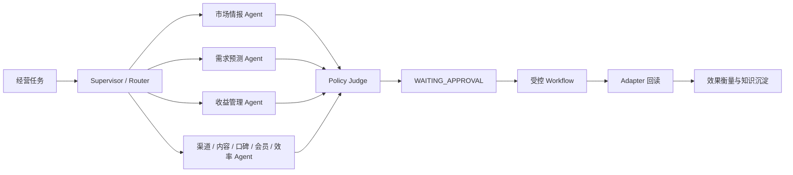

# Agent 编排架构

平台按需求文档第 6 至 11 章实施受治理的 Agent 闭环：

## 责任边界

- `SupervisorAgent`：根据 `task_type` 选择专项 Agent，不读取数据库、不调用 Adapter、不执行写操作。
- `SpecialistAgent`：只输出结构化建议、证据引用、置信度和适用条件。
- `OperationsGraph`：使用 LangGraph 运行 Supervisor、专项节点与 Policy Judge，并冻结 `AgentState.data_cutoff`。
- `ApprovalPolicy`：审批后验证策略参数哈希，拒绝变更后执行。
- `LocalChannelAdapter`：仅用于本地回读契约；正式平台接入必须使用授权 Adapter。

## 当前专项 Agent

市场情报、需求预测、收益管理、渠道运营、内容增长、口碑会员、经营效率均已注册到 Supervisor 路由表。当前专项节点采用可替换的结构化规则基线；接入模型时只能替换节点内部推理，不能绕过 Pydantic 输出、Policy Judge、审批、幂等和回读。
