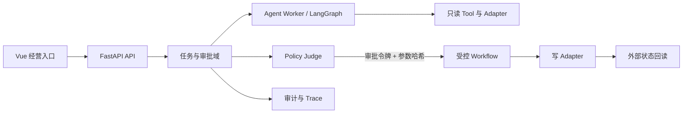

# 架构与边界

一期采用模块化单体 `api` 加独立 `agent-worker` 的演进结构。现有 `TaskService` 是最小示例实现；不得将其直接延伸为生产写入能力。

## 不可违反的规则

1. Agent 只能产生结构化建议，不能直接执行写操作。
2. 写 Adapter 仅能由 Workflow 调用；必须验证审批令牌、幂等键和参数哈希。
3. 每项策略绑定 `tenant_id`、`property_id`、数据截止时间、来源版本、证据和观察窗。
4. 外部系统成功响应后仍须回读；缺少回读时状态不得标记为成功。
5. 生产连接器只使用已授权的官方接口或合法人工导入；当前框架全部使用 Mock Adapter。

## 模块分工

| 小组 | 负责模块 | 第一项可验收成果 |
| --- | --- | --- |
| A | 数据与指标 | OCC/ADR/RevPAR 和 Pickup 的版本化口径 |
| B | 市场与事件 | Compset、快照证据、活动日历 |
| C | 策略与审批 | 状态机、审批矩阵、参数哈希校验 |
| D | 内容与口碑 | 素材权利、AI 标识、审核草稿 |
| E | 平台工程 | Docker、CI、Trace、故障注入 |
