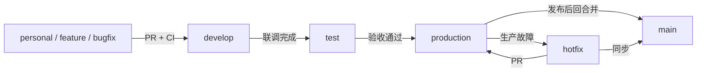

# 分支管理策略

## 分支模型

| 分支 | 类型 | 用途 | 允许合并来源 | 部署目标 |
| --- | --- | --- | --- | --- |
| `main` | 主分支 | 经评审的稳定代码基线和版本历史 | `develop`、紧急修复 PR | 无直接部署 |
| `develop` | 开发集成分支 | 日常功能集成和联调 | `feature/*`、`personal/*`、`bugfix/*` | 开发环境 |
| `test` | 测试分支 | QA、验收和回归测试候选版本 | `develop`、`release/*` | 测试环境 |
| `production` | 生产分支 | 已验收的生产发布版本 | `test`、`hotfix/*` | 生产环境 |
| `personal/<github-id>` | 个人工作分支 | 开发人员的持续工作分支 | 不直接部署 | 无 |
| `feature/<issue>-<topic>` | 功能分支 | 单一需求或功能开发 | 不直接合并其他功能分支 | 无 |
| `bugfix/<issue>-<topic>` | 缺陷分支 | 测试或开发环境缺陷修复 | 不直接部署 | 无 |
| `hotfix/<issue>-<topic>` | 紧急修复分支 | 生产问题的最小修复 | `production` 为起点 | 生产紧急修复 |

已为当前仓库创建 `personal/lengbaiy` 作为个人工作分支。新增成员应从 `develop` 创建自己的 `personal/<github-id>` 或短生命周期功能分支。

## 标准合并路径



正常发布严格遵循 `develop → test → production → main`。`main` 是稳定历史基线；生产发布以 `production` 为唯一来源。每次从 `production` 发布后，必须合并回 `main`，避免发布版本与主干历史分叉。

## 工作流程

### 功能开发

```bash
git checkout develop
git pull --ff-only origin develop
git checkout -b feature/123-market-signal
# 开发、测试、提交
git push -u origin HEAD
```

创建到 `develop` 的 Pull Request，关联 Issue，并在 CI 通过、代码评审完成后合并。

### 测试与发布

```bash
# 联调完成后发起 develop -> test 的 PR
# 验收通过后发起 test -> production 的 PR
# 发布确认后发起 production -> main 的 PR
```

禁止用本地强推替代 Pull Request；禁止跳过 `test` 直接将日常功能发布到 `production`。

### 生产紧急修复

```bash
git checkout production
git pull --ff-only origin production
git checkout -b hotfix/456-rate-sync-timeout
# 修复、测试、提交
git push -u origin HEAD
```

紧急修复须首先通过 PR 合并至 `production`，并在发布后同步合并至 `main` 与 `develop`。

## 分支保护要求

对 `main`、`develop`、`test`、`production` 启用以下规则：

1. 禁止直接推送、删除与强制推送。
2. 必须通过 Pull Request 合并；`production` 至少需要 2 位批准，其余受保护分支至少需要 1 位批准。
3. 必须通过 CI 的后端检查、前端检查和构建。
4. 合并前必须与目标分支同步，并解决所有审查意见。
5. 管理员不绕过保护规则；紧急变更仍需保留审计记录和后续复盘。

## 命名与提交

- 分支名使用小写英文、数字和短横线；Issue 编号紧随类型前缀。
- 提交使用 Conventional Commits：`feat`、`fix`、`docs`、`test`、`refactor`、`chore`。
- 每个 PR 仅解决一个明确目标；描述必须包含变更说明、验证方式、风险与回滚方案。
- 不提交密钥、Cookie、生产数据或未脱敏客户数据。

