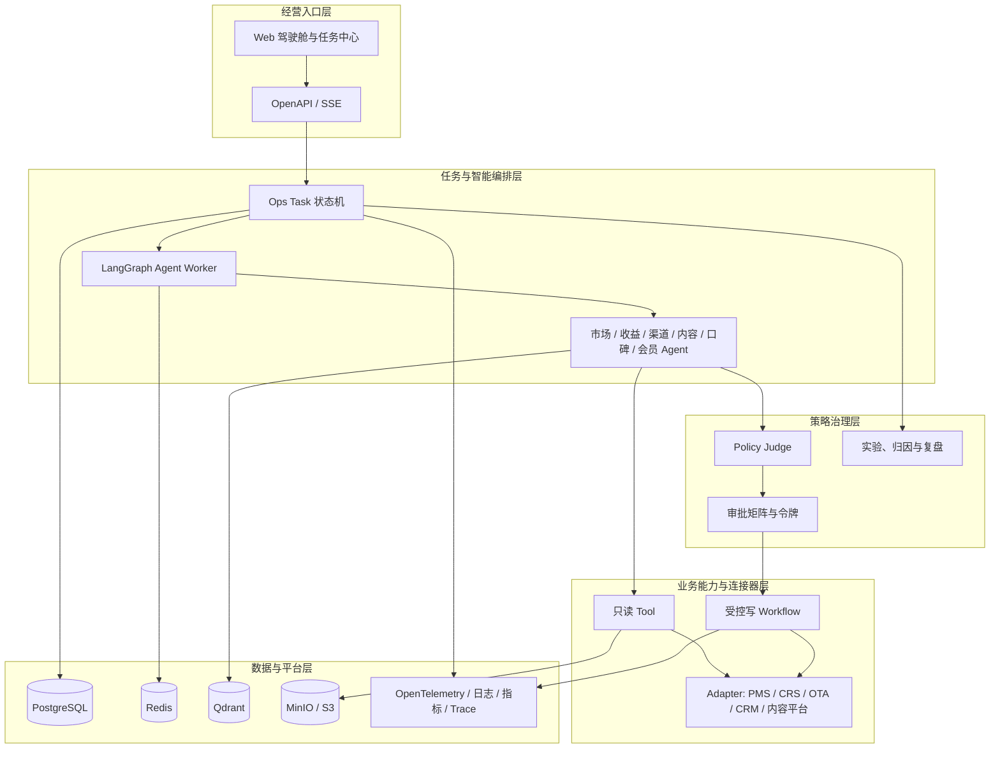
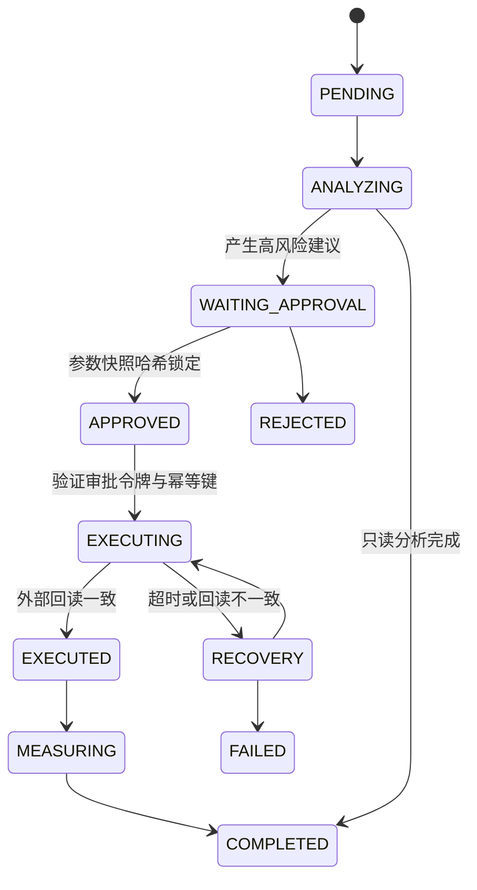

# 总体架构

平台采用“经营入口 - 任务编排 - 策略治理 - 业务能力 - 数据资产”的分层架构。Agent 负责感知、分析、规划与解释；所有确定性写操作只能经过策略治理、人工审批和受控 Workflow。

## 服务职责

| 服务 | 主要职责 | 禁止事项 |
| --- | --- | --- |
| `frontend` | 驾驶舱、任务、审批与结果展示 | 直接调用外部业务平台 |
| `api` | 身份权限、任务、审批、查询 API | 由模型驱动直接写业务系统 |
| `agent-worker` | Agent 编排、结构化建议、Tool 选择 | 绕过 Policy Judge 或审批 |
| `scheduler` | 晨报、监控、复盘和重试调度 | 对未审批策略自动执行 |
| `adapter` | 屏蔽 PMS/OTA/内容平台差异 | 保存平台密钥到日志或 Prompt |
| `evaluation` | 固定评测、回归与质量报告 | 用未脱敏生产数据作为测试集 |

## 核心状态流转

## 部署拓扑

开发环境使用 `Docker Compose` 运行 Web、API、PostgreSQL、Redis、Qdrant 和 MinIO。生产环境将 API、Worker、Scheduler 和 Adapter 分别横向扩展；数据库、对象存储、密钥管理、监控和备份采用托管或高可用服务。外部平台仅通过已授权的 Adapter 访问。
