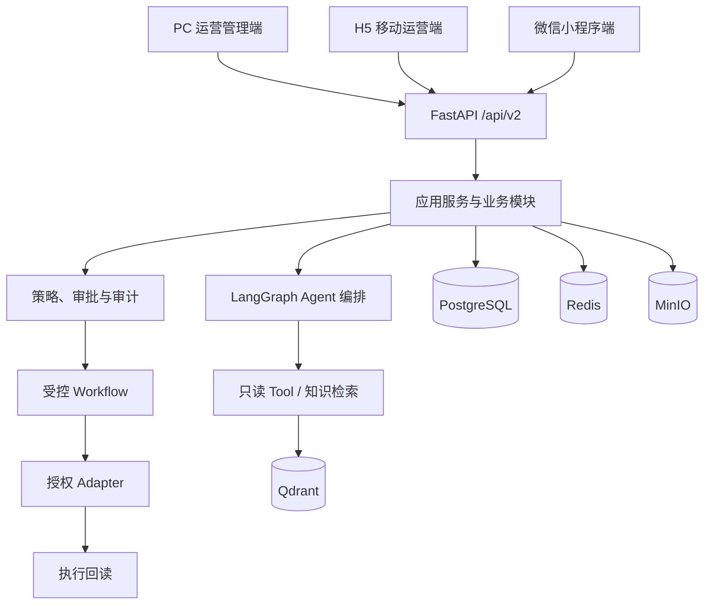
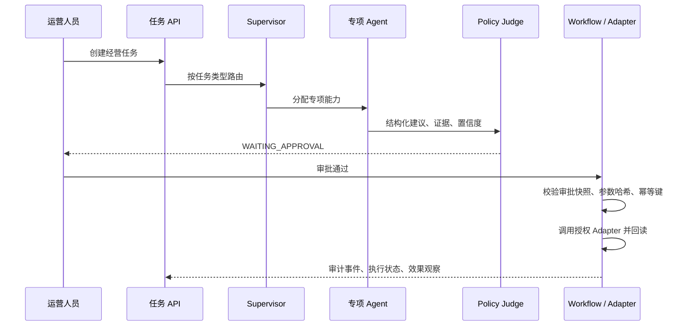

# 项目框架说明

## 1. 建设目标

酒店智能运营 Agent 平台以“数据驱动建议、受控审批执行、结果回读衡量”为主线，为多酒店、多角色运营提供可扩展的经营智能能力。项目按需求规格说明书 V2.0 建设，当前代码库是可持续开发的企业级工程骨架，不将模拟数据或本地 Adapter 作为生产能力使用。

## 2. 总体架构

平台遵循模块化单体加异步 Worker 的演进架构：一期保持部署和调试简单；当外部连接器、任务吞吐或团队规模增长时，可将专项模块和 Worker 平滑拆分。

## 3. Agent 运行闭环

当前已接入的 Supervisor 路由包括：市场情报、需求预测、收益管理、渠道运营、内容增长、口碑会员和经营效率。专项 Agent 的输出必须是结构化建议，且必须携带证据引用、置信度、数据截止时间和适用条件。任何 Agent 都没有直接外部写入权限。

## 4. 工程分层

| 层次 | 目录 | 职责 |
| --- | --- | --- |
| 客户端层 | `frontend/`、`clients/mobile-ops/` | PC 管理端，以及同源的 H5 / 微信小程序运营端 |
| 接入层 | `backend/app/api/`、`backend/app/schemas/` | API 版本、HTTP 契约、参数校验、鉴权接入 |
| 应用层 | `backend/app/services/`、`backend/app/modules/` | 用例编排、业务域服务和事务边界 |
| 智能层 | `backend/app/agents/`、`backend/app/graph/` | Agent 状态、Supervisor、专项 Agent、LangGraph 编排 |
| 治理层 | `backend/app/policy/`、`backend/app/evaluation/` | 审批、策略校验、效果衡量、评测 |
| 集成层 | `backend/app/tools/`、`backend/app/adapters/` | 只读数据工具、第三方系统连接器、执行回读 |
| 数据层 | `backend/app/repositories/`、`backend/app/db/`、`backend/migrations/` | 仓储抽象、数据库模型、迁移 |
| 平台层 | `docker-compose.yml`、`.github/workflows/`、`scripts/` | 本地运行、CI、接口文档导出和开发辅助脚本 |

依赖方向始终从外向内：客户端调用 API；API 调用应用服务；应用服务协调领域、Agent、治理和仓储；Adapter 只能经受控 Workflow 调用。业务模块不得反向依赖前端，也不得绕过策略治理直接写入外部系统。

## 5. 三端交付策略

| 终端 | 工程 | 使用场景 | 共享能力 |
| --- | --- | --- | --- |
| PC 管理端 | `frontend/` | 驾驶舱、审批、策略配置、数据复盘 | `packages/shared-api/`、`packages/shared-contracts/` |
| H5 运营端 | `clients/mobile-ops/` | 移动巡检、待办处理、告警查看 | UniApp 同源代码、共享 API 与类型契约 |
| 微信小程序端 | `clients/mobile-ops/` | 轻量任务处理、消息触达、审批确认 | UniApp 同源代码、共享 API 与类型契约 |

三端复用接口契约和业务枚举，不复用复杂页面布局。鉴权、租户、酒店范围和数据权限均由服务端最终校验。

## 6. 核心业务域

| 业务域 | 关键能力 | Agent 输出 |
| --- | --- | --- |
| 经营总览与任务 | 指标、待办、任务状态、Trace | 任务编排结果 |
| 市场情报 | 竞品、活动、市场信号 | 证据卡与影响判断 |
| 需求预测 | 需求区间、驱动因素、压缩夜 | 预测与风险提示 |
| 收益管理 | 房价、库存、促销策略 | 价格与库存建议 |
| 渠道运营 | 渠道库存、房价、活动冲突 | 渠道分配建议 |
| 内容增长 | 内容计划、素材权利、发布审核 | 内容草案与审核建议 |
| 口碑会员 | 点评闭环、客群、频控 | 服务与会员策略 |
| 经营效率 | 客房、清扫、早餐、前厅负荷 | 容量与排班建议 |

需求到模块、数据对象和验收点的映射见 [PRD_TRACEABILITY.md](PRD_TRACEABILITY.md)。

## 7. 数据、治理与安全基线

1. 每项业务数据、任务和执行记录必须绑定 `tenant_id`、`property_id` 和 `trace_id`。
2. 指标、预测和建议必须记录数据截止时间、来源版本、口径版本、时区和币种。
3. Agent 仅可产生建议；执行前必须完成审批，且审批快照与执行参数的 SHA-256 哈希一致。
4. 外部写入只能由 Workflow 经授权 Adapter 执行，并携带幂等键；成功后必须回读外部状态。
5. 生产环境只能使用合法授权的接口或人工导入；密钥保存在环境变量或密钥服务，不进入仓库。
6. 执行、审批、失败和回读均写入审计事件，供 Trace、复盘与效果评估使用。

## 8. 开发与验收流程

1. 从需求追踪矩阵选择一个纵向能力，并创建 Issue。
2. 先定义 API Schema、领域模型、权限与审计事件，再实现应用服务和前端页面。
3. 涉及 Agent 时，补充路由规则、结构化输出模型、证据要求、评测样例与降级策略。
4. 涉及外部系统时，先实现 Adapter 契约和 Local Adapter，再接入授权生产 Adapter。
5. 提交 Pull Request；CI 必须通过后端测试、Ruff、前端 ESLint/Prettier 和构建。
6. 通过评审后合并；执行类能力必须额外验收审批、幂等、回读和审计链路。

详细开发操作见 [DEVELOPMENT_GUIDE.md](DEVELOPMENT_GUIDE.md)，接口说明见 [API_GUIDE.md](API_GUIDE.md)，Agent 责任边界见 [AGENT_ARCHITECTURE.md](AGENT_ARCHITECTURE.md)。

## 9. 当前实现边界与下一步

已实现任务、Agent 路由、结构化建议、审批状态、审计事件、API 文档、三端工程入口和 CI 骨架。专项 Agent 当前使用可替换的规则基线，后续可以接入大模型、知识库和正式数据源；替换只能发生在专项节点内部，不能改变结构化输出、审批、策略校验、幂等和执行回读边界。

